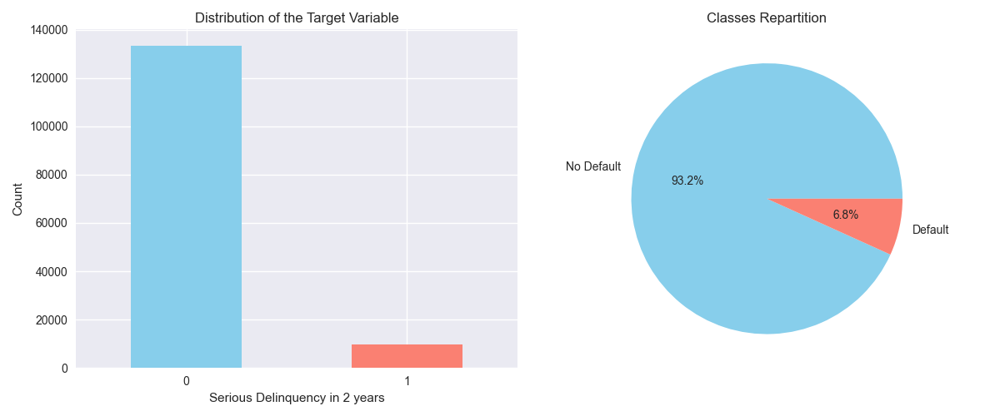
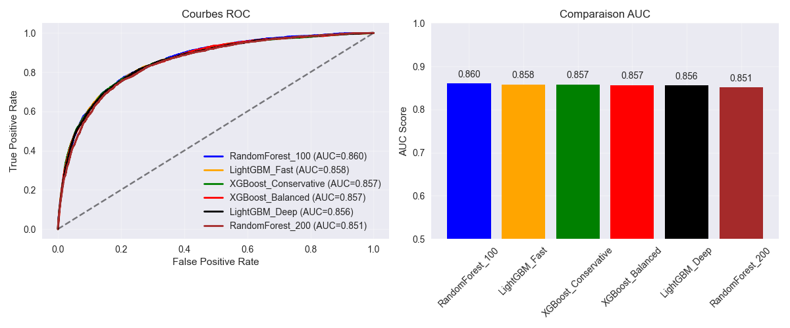
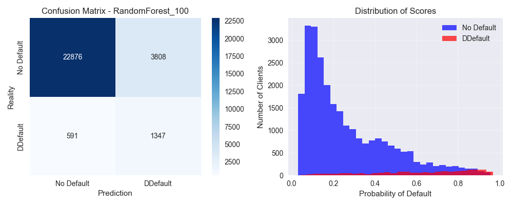
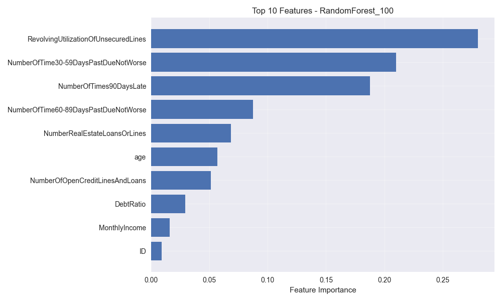

# 📊 Business Documentation - Credit Scoring System

## 📋 Executive Summary

### Context
The banking sector requires powerful tools to assess the risk of default for clients applying for credit. Poor evaluation can result in significant financial losses (risky clients being accepted) or missed opportunities (solvent clients being rejected).

### Developed Solution
An automated credit scoring system based on Machine Learning that predicts the probability of a client defaulting within the next 2 years. The system analyzes 10 key financial profile variables and provides a recommendation to accept or reject.

### Key Results
- **Model Accuracy:** 86.7% (AUC)
- **Intuitive Interface:** Dashboard accessible to business teams with no technical skills

---

## 🎯 Project Objectives

### Business Objectives
1. **Reduce financial losses** due to payment defaults  
2. **Speed up the decision process** for credit approvals  
3. **Standardize evaluations** to reduce subjectivity  
4. **Optimize acceptance rates** to maximize profit while controlling risk  

### Technical Objectives
1. Develop a reliable predictive model   
2. Build an intuitive user interface  
3. Ensure reproducibility and maintainability of the system  
4. Enable batch processing for large volumes  

---

## 📊 The Data

### Source
**"Give Me Some Credit"** Kaggle dataset containing 150,000 anonymized client profiles with their credit history.

### Analyzed Variables

| Variable | Description | Risk Impact |
|----------|-------------|-------------|
| **Age** | Client’s age in years | ⬇️ Older clients are generally less risky |
| **Monthly Income** | Monthly income in euros | ⬇️ Higher income = lower risk |
| **Debt-to-Income Ratio** | Monthly debts / Monthly income | ⬆️ Higher ratio = higher risk |
| **Revolving Credit Utilization** | % of credit card utilization | ⬆️ Above 80% = red flag |
| **Number of Dependents** | Financial dependents | ⬆️ More dependents = higher risk |
| **Open Credits** | Total number of active credits | ➡️ Variable impact depending on profile |
| **Mortgage Loans** | Number of mortgage loans | ⬇️ Indicator of financial stability |
| **30-59 Days Past Due** | Moderate payment delays (last 2 years) | ⬆️ Indicates difficulties |
| **60-89 Days Past Due** | Serious payment delays (last 2 years) | ⬆️⬆️ Increased risk |
| **90+ Days Past Due** | Severe payment delays | ⬆️⬆️⬆️ Strong risk indicator |

### Data Quality
- **Size:** 150,000 clients  
- **Period:** Historical data over 2 years  
- **Imbalance:** 6.7% default rate (realistic for banking)  
- **Processing:** Missing values imputed, outliers treated  

---

## 🤖 Machine Learning Model

### Methodological Approach

#### 1. Data Preparation (Preprocessing Phase)
- **Cleaning:** Handling missing and outlier values 
- **Normalization:** Scaling for comparability  

#### 2. Modeling
We tested **10 model variations**:  
- Logistic Regression (2 variations)  
- Random Forest (3 variations: 100, 200, 500 trees)  
- XGBoost (3 variations: conservative, aggressive, balanced)  
- LightGBM (2 variations: fast, deep)  

#### 3. Rigorous Validation
- **Data Split:**  
  - 80% Training (pattern learning)  
  - 20% Testing (model selection)  
  - Separate Validation Dataset (real-world evaluation)  
- **Imbalance Handling:** SMOTE technique  
- **Overfitting Prevention:** The unseen test data  

### Model Performance

#### Metric
- **AUC Score: 0.86** ⭐ (Excellent - acceptance threshold > 0.80) 

#### Business Interpretation

**Confusion Matrix(for 10 000 costumers):**

|                    | **Predicted: Approved** | **Predicted: Rejected** |
|--------------------|--------------------------|--------------------------|
| **Reality: Solvent** | ✅ 7855(True Negative)   | ⚠️ 1308 (False Positive)   |
| **Reality: Risky**   | 🚨 203 (False Negative)     | ✅ 634 (True Positive)  |

**Error Analysis:**  
- **False Positives :** Solvent clients rejected → Business opportunity loss  
  - Estimated cost: 450 × €100 = €45,000  
- **False Negatives :** Risky clients accepted → Potential losses  

### Most Important Variables

**Top 5 Decision Factors:**  
1. **Revolving Credit Utilization** (28%)
2. **30-59 Days Past Due** (21%)
3. **90+ Days Past Due** (19%)
4. **60-89 Days Past Due** (9%)
5. **Mortgage Loans** (7%) 

---

## 💻 Interactive Dashboard

### Features

#### 1. Individual Scoring
**Use Case:** Real-time client evaluation  

**Process:**  
1. Advisor fills in 10 client details  
2. Clicks "Calculate Score"  
3. Instant result:  
   - Risk score (0-100%)  
   - Risk level (🟢 Low / 🟡 Moderate / 🔴 High)  
   - Recommended decision (✅ Approve / ⚠️ Review / ❌ Reject)  
   - List of identified risk factors  

**Processing time:** < 1 second  

#### 2. Portfolio Analysis
**Use Case:** Batch processing  

**Process:**  
1. Upload a CSV or PKL with multiple clients  
2. Automatic processing of all profiles  
3. Results:  
   - Global statistics (approval rate, average risk)  
   - Visualizations (score distribution, segments)  
   - Exportable decisions  

#### 3. Threshold Simulation
**Use Case:** Optimize acceptance criteria  

**Benefit:** Adapts strategy (growth vs caution)  

### Dashboard Advantages
✅ **Accessible:** Web-based, no heavy installation  
✅ **Simple:** No technical skills required  
✅ **Fast:** Real-time decisions  
✅ **Traceable:** Exportable results  
✅ **Transparent:** Risk factor explanations  

---

## 💰 Business Benefits

### Quantitative Gains

#### 1. Loss Reduction

### Before
- **Default rate :** 6.8% 

### After
- **Risk detection:** 70% (Recall)
- **Expected default risk :** ~2%  
- **Savings:** 4,8% of portfolio  

**⚠️ Important - Compromise**
- The model detects high-risk customers well (70%)
- However it turns down a lot of good costumer (26%)

### Qualitative Gains
✅ **Standardization:** Consistent, objective decisions  
✅ **Compliance:** Traceability for regulations  
✅ **Training:** Pedagogical tool for new advisors  
✅ **Strategy:** Scenario simulations for management  

---

## 🎯 Real-World Use Cases

### Case 1: Standard Client
- **Profile:** Pierre, 35, engineer, €3,500/month, 2 dependents, 1 mortgage, no delays, 25% credit card use  
- **Result:** Risk score **18%** 🟢 → **✅ APPROVE**  

### Case 2: Moderate Risk Client
- **Profile:** Sophie, 28, sales rep, €2,200/month, single, 3 consumer loans, 1 delay (60 days), 85% card use  
- **Result:** Risk score **52%** 🟡 → **⚠️ REVIEW**  

### Case 3: High-Risk Client
- **Profile:** Marc, 42, temp worker, €1,600/month, 3 dependents, 5 loans, 2 severe delays, 98% card use  
- **Result:** Risk score **78%** 🔴 → **❌ REJECT**  

